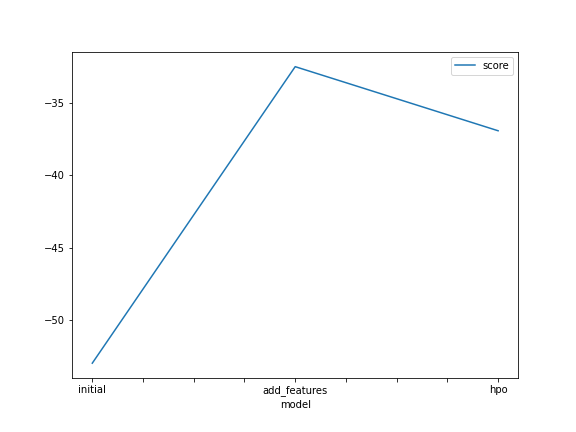

# Report: Predict Bike Sharing Demand with AutoGluon Solution
#### NAME HERE

## Initial Training
### What did you realize when you tried to submit your predictions? What changes were needed to the output of the predictor to submit your results?

My Predictions did not have negative values, If they did i would have needed to convert them to zero before submitting.

### What was the top ranked model that performed?

WeightedEnsemble_L3

## Exploratory data analysis and feature creation
### What did the exploratory analysis find and how did you add additional features?

The season and weather had an int data type and I converted them to category data type.
I separated the datetime into year, month, day, and hour for the additional features.

### How much better did your model preform after adding additional features and why do you think that is?

The RMSE score decreased from 1.78825 to 0.0.46063, which shows an improvement.

## Hyper parameter tuning
### How much better did your model preform after trying different hyper parameters?

After tuning hyper parameters I had an improvement with the RMSE score of my model which changed fron 0.46063 to 0.45665

### If you were given more time with this dataset, where do you think you would spend more time?

I will spend more time tuning the hyper parameters and adding custom hyper parameters. So as to get a better score. Also I will test individual algorithms on the data, algorithms such as XgBoost.

### Create a table with the models you ran, the hyperparameters modified, and the kaggle score.
|model|hpo1|hpo2|hpo3|score|
|--|--|--|--|--|
|initial|1|8|20|1.78825|
|add_features|1|8|20|0.46063|
|hpo|1|6|20|0.45665|

### Create a line plot showing the top model score for the three (or more) training runs during the project.

TODO: Replace the image below with your own.

### Create a line plot showing the top kaggle score for the three (or more) prediction submissions during the project.

TODO: Replace the image below with your own.

## Summary

This is a regression model built from Kaggle Bike Sharing demand dataset. After the initial training a score of 1.84484 was gotten and when i split the datetime column to hour, day, week, month and year I got a score of 0.46063. But when i tune the some hyper parameters, I had a score of 0.45665.

I believe that with other training algorithms and spending more time on tuning the hyper parameters i can improve my score.